

  

<h1 align="center"> <b>mCare</b></h1>

  <strong>Integrated Patient & Doctor Healthcare Management System</strong> 
  Simplifying healthcare with digital appointments, secure records, and real-time communication.

---

mCare (Integrated Patient & Doctor Healthcare Management System) is a web application that streamlines healthcare by digitizing appointments, treatment records, and medication reminders. It bridges the gap between patients, doctors, and administrators through a secure, user-friendly platform.

With features like online appointment scheduling, electronic prescriptions, medication tracking, and telemedicine, mCare enhances healthcare accessibility, efficiency, and patient satisfaction—making healthcare smarter, faster, and more connected.

---

### 🖼️ Application Interface

Below are some key interface screens from the **mCare Web Application**, highlighting the user experience for Patients, Doctors, and Admins.

---
### 🏠 Home Page  

The **Home Page** of **mCare** serves as the welcoming interface for users. It introduces the platform’s purpose — to simplify healthcare through seamless digital interaction.  
Users can quickly explore services, book appointments, consult doctors, and access essential healthcare support from one place.  

Key highlights of the Home Page:  
- 💡 Clean, modern, and responsive design.  
- 🧭 Easy navigation to Services, Doctors, About, and Contact sections.  
- 🔐 Quick access to Login / Signup for Patients, Doctors, and Admins.  
- 🕒 Prominent features like 24/7 Support, Secure Platform, and Verified Experts.

  

---

### 🔐 Login & Signup Pages  

The **Login and Signup interface** in **mCare** ensures a secure and user-friendly authentication process for all three roles — **Patient**, **Doctor**, and **Admin**.  
Each user can create an account, verify their identity through OTP, and log in securely with role-based access control.  

#### 🧾 Key Highlights:
- Role-based authentication for **Patients**, **Doctors**, and **Admins**.  
- OTP verification for enhanced security during registration.  
- Password strength indicator for user awareness.  
- Simple, modern, and responsive interface for better usability.

---

#### 🏠 Patient Registration Page  
Patients can create an account by providing their personal details and email. The interface is designed with validation and password strength indicators for better security.

  

---

#### 👨‍⚕️ Doctor Registration Page  
Doctors can sign up with professional details and email verification. The OTP verification process ensures that only verified medical professionals can register.

  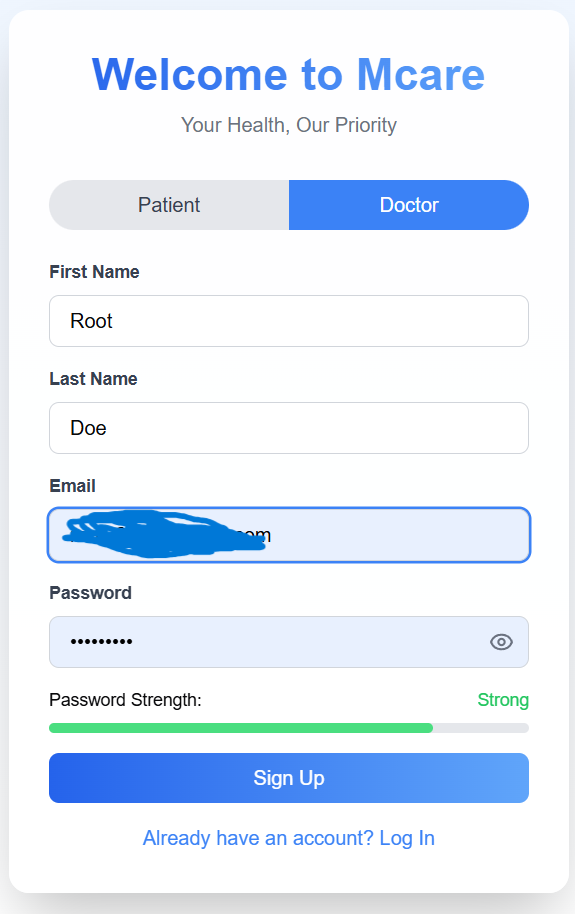

---

#### 📩 OTP Verification Page  
Once users register, they receive a one-time password (OTP) on their registered email for verification. This adds an extra layer of authentication before activating the account.

  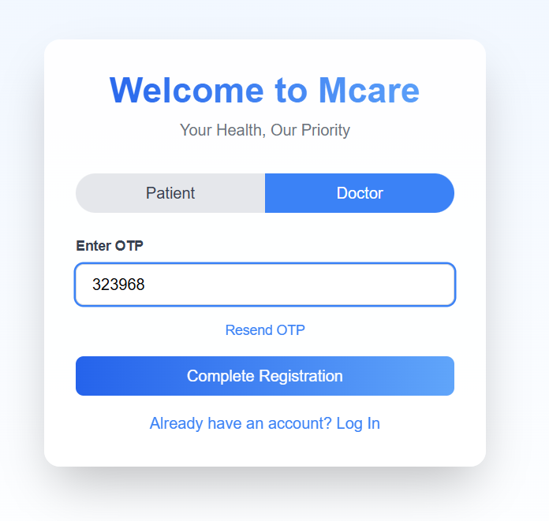

---

### 📧 Email OTP Verification  
After registration, an automated email is sent to the user's registered address containing the OTP code.  
The user must enter this OTP within **5 minutes** to complete verification.  
This secure verification process ensures system integrity and prevents unauthorized registrations.

  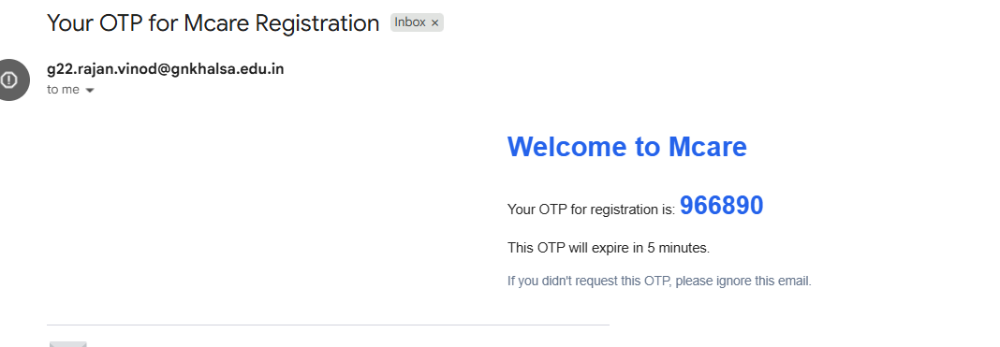

---

#### 🔑 Login Page  
After successful registration, users can log in by selecting their role — Patient, Doctor, or Admin.  
This role-based login ensures that each user accesses only the features relevant to their role.

  

---

### 🔁 Forgot Password & Password Reset  

The **Forgot Password** feature in **mCare** ensures that users can securely recover their accounts if they forget their credentials.  
This module includes OTP-based verification to confirm user identity before allowing password reset.

---

#### 📨 Forgot Password (Request OTP)  
Users enter their registered email to request an OTP for password reset. The system automatically sends a one-time password to their email address.

  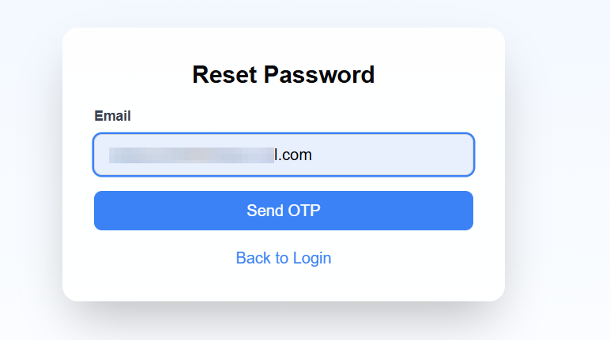

---

#### 📧 Password Reset Email  
An email containing a 6-digit OTP is sent to the user’s registered email.  
This OTP expires in **5 minutes** to ensure security and prevent unauthorized access.

  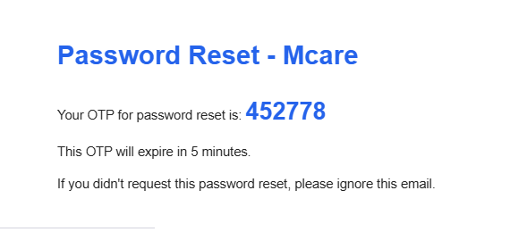

---

#### 🔒 Reset Password Page  
After entering the valid OTP, users can securely reset their password by entering and confirming a new one.  
This ensures that only verified users can modify their credentials.

  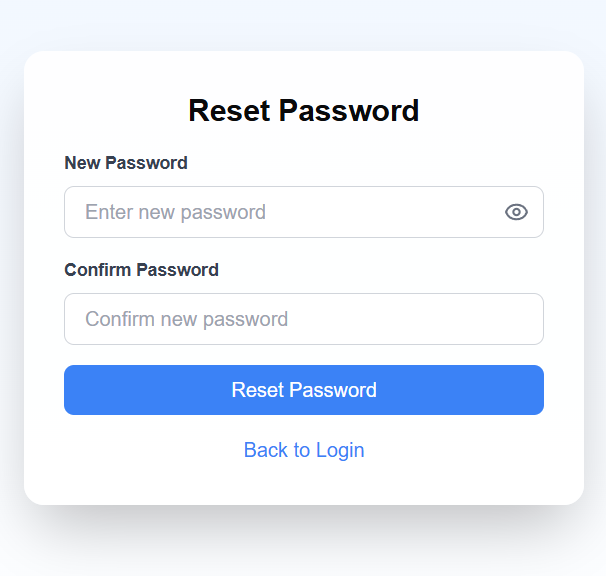

---

### 🩺 Patient Dashboard

The **Patient Dashboard** is the central hub for patients to view their health overview and manage everything in one place. It provides quick access to upcoming appointments, active medications, recent health records, telemedicine sessions, and reminders — all from a clean, easy-to-use interface.

  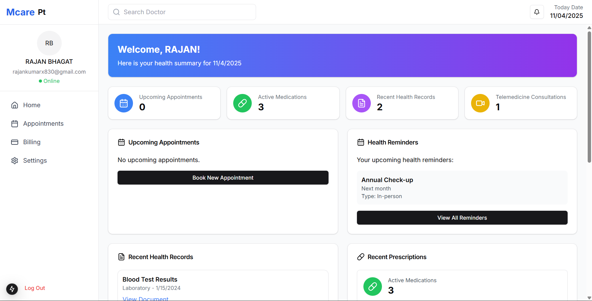

#### Key Highlights
- **Welcome banner & summary:** Personalized greeting with today’s date and a quick health summary.  
- **Status cards:** At-a-glance metrics for upcoming appointments, active medications, recent records, and telemedicine count.  
- **Quick actions:** Buttons to book new appointments, view reminders, and access prescriptions or records.  
- **Recent items:** Lists for recent health records and prescriptions with quick links to view/download documents.  
- **Left navigation:** Persistent sidebar for Home, Appointments, Billing, Settings, and Log Out — keeps navigation consistent across the app.  
- **Responsive layout:** Cards and panels collapse gracefully for smaller screens.

#### What a patient can do from this screen
- Book, reschedule, or cancel appointments via **Book New Appointment**.  
- View and download recent test results or prescriptions from **Recent Health Records**.  
- See medication adherence at a glance and open detailed medication info from **Active Medications**.  
- Start or join telemedicine sessions directly from the dashboard.  
- Access billing history and update profile or notification settings from the sidebar.

---
#### 🏠 Home Overview  
This section provides a summary of the patient’s current health information, including upcoming appointments, medication status, health reminders, and recent prescriptions.

  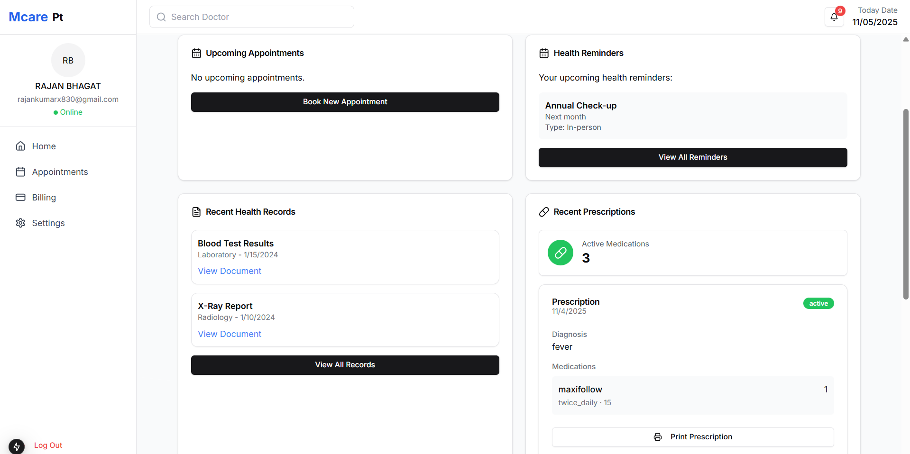

**Highlights:**  
- Displays the number of upcoming appointments, active medications, and recent health records.  
- Allows patients to **book a new appointment** directly from the dashboard.  
- Shows **recent test reports** such as blood test or X-ray results with quick view/download options.  
- Lists **active prescriptions** with medication names, dosage, and status (e.g., active/inactive).  
- **Health reminders** alert users about upcoming check-ups or important activities.  
- Provides easy navigation through the sidebar (Home, Appointments, Billing, Settings).  

---

#### 💊 My Prescriptions  
The prescription section lets patients review all active medications prescribed by their doctors.  
It includes dosage details, prescription date, and diagnosis notes, with a **Print Prescription** option for convenience.

  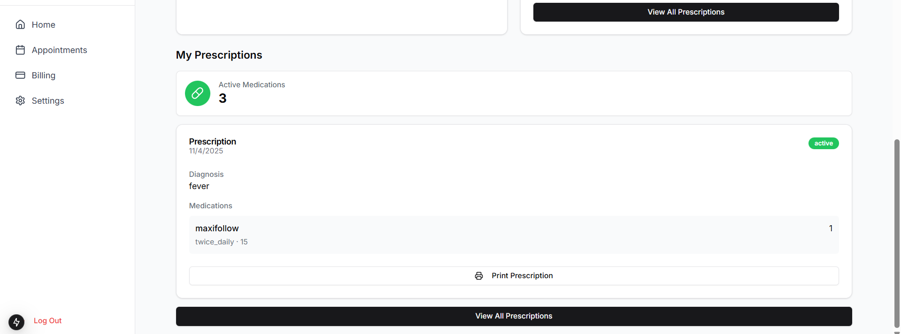

**Highlights:**  
- View complete prescription history with medication details and dosage.  
- Option to print or download prescriptions directly.  
- Shows diagnosis and date of issue.  

---

#### 🔔 Notification Panel  
The notification bar provides real-time updates related to medication reminders, appointment confirmations, and health alerts.  
It ensures patients never miss any important medical event or reminder.

  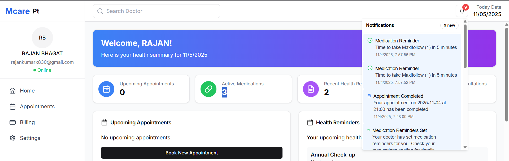

**Highlights:**  
- Real-time medication reminders with timestamps.  
- Appointment completion and scheduling notifications.  
- Secure and organized list of all recent notifications.  
- Visual badge counter on the bell icon shows unread notifications count.  

---
---

### 📅 Patient – Appointment Management

The **Appointment Section** in *mCare* allows patients to easily find doctors, book new appointments, and manage all scheduled consultations in one place.  
It provides a seamless and organized experience for patients to handle upcoming, past, and cancelled appointments efficiently.

---

#### 🩺 Find a Doctor
Patients can search for doctors by **name, specialization, or consultation type (video/in-person)**.  
Each doctor’s profile displays their experience, location, and availability for both online and in-person consultations.  
Users can view the next available slot and click **“Request Appointment”** to instantly send a booking request.

  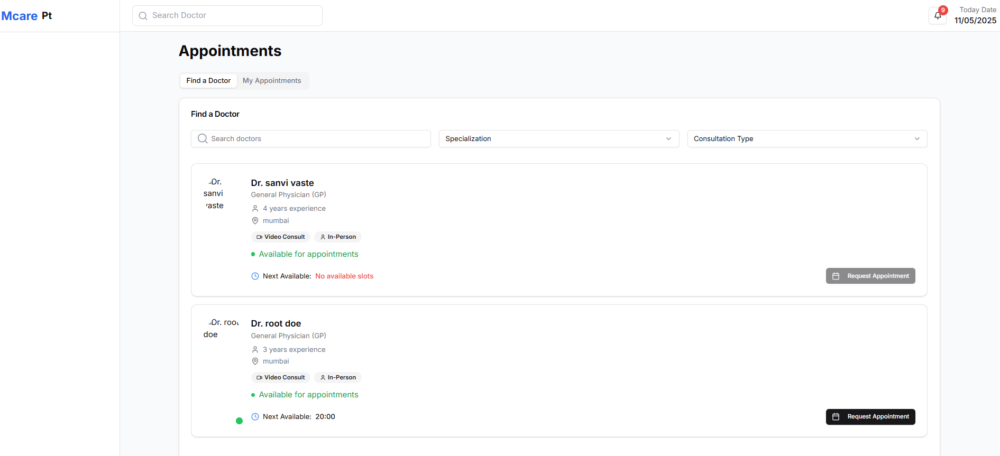

**Highlights:**
- Filter and search doctors by specialization or consultation mode.  
- Shows doctor’s details such as name, experience, and city.  
- Real-time availability display (“Available for appointments” or “No available slots”).  
- Option to book online (video consult) or offline (in-person) visits.

---

#### 🗓️ Request Appointment Popup
When a patient selects “Request Appointment,” a **popup form** appears to confirm the booking.  
Here, the patient can choose the **date**, **time**, and **consultation type**, and optionally add a short **note or symptoms** for the doctor before submitting the request.

  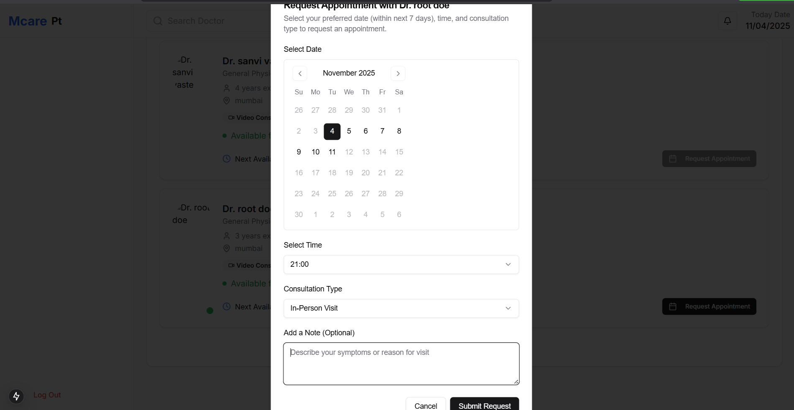

**Key Features:**
- Interactive calendar for selecting preferred appointment date (within the next 7 days).  
- Dropdown menu for choosing a suitable time slot.  
- Option to pick **In-Person Visit** or **Video Consultation.**  
- Input box to add any note, symptoms, or reason for the visit (optional).  
- **Submit Request** button sends the appointment data securely to the doctor for confirmation.  
- **Cancel** option allows the user to exit without saving changes.

This form ensures accuracy in scheduling and helps doctors prepare by understanding the patient’s needs in advance.

---

#### 🗂️ My Appointments – Overview
The **My Appointments** tab allows patients to view all their bookings divided into three categories — **Upcoming**, **Past**, and **Cancelled**.

  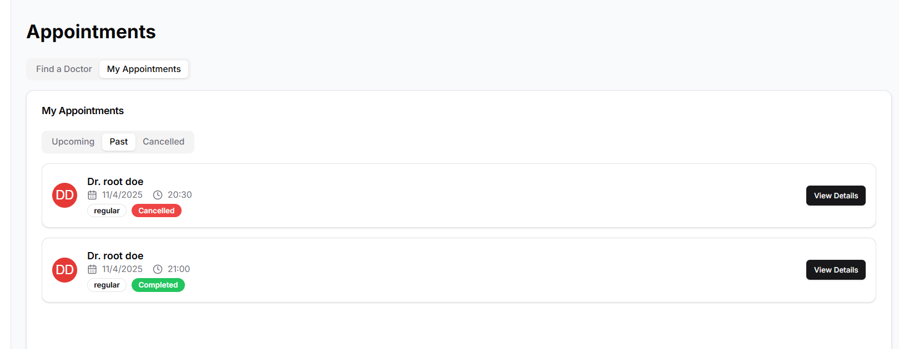

**1. Upcoming Appointments:**  
Displays all scheduled appointments with date, time, and doctor’s name. Patients can view details or cancel if needed.  

**2. Past Appointments:**  
Lists previously completed sessions along with status tags such as **Completed** or **Cancelled**, making it easy to review medical history.

  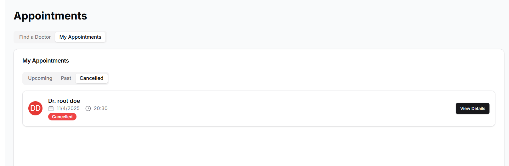

**3. Cancelled Appointments:**  
Shows appointments that the patient or doctor has cancelled, with clear status labels and date/time records.

---

#### 💡 Key Features
- Easy switching between appointment categories using tabs (Upcoming, Past, Cancelled).  
- Consistent layout with doctor’s initials, name, date, time, and appointment status.  
- Quick **View Details** button for more appointment info.  
- Clearly visible status indicators (🟢 *Completed*, 🔴 *Cancelled*).  
- Responsive design — all cards adjust neatly on smaller screens.  

---

**In short**, the **Appointment Management Section** in *mCare* simplifies the process of finding, booking, and tracking doctor appointments.  
It ensures patients have complete control over their medical schedules with clarity, convenience, and flexibility.

---
---

### ⚙️ Patient – Settings Module

The **Settings Module** in *mCare* provides patients with complete control over their account, profile, privacy, and notification preferences.  
It ensures personalization, security, and easy management of personal and medical data through an intuitive, user-friendly interface.

---

#### 👤 Profile Settings

Patients can view and update their personal, contact, and physical information in one place.  
Each patient is assigned a **unique Patient ID**, ensuring proper identification and secure record management.

  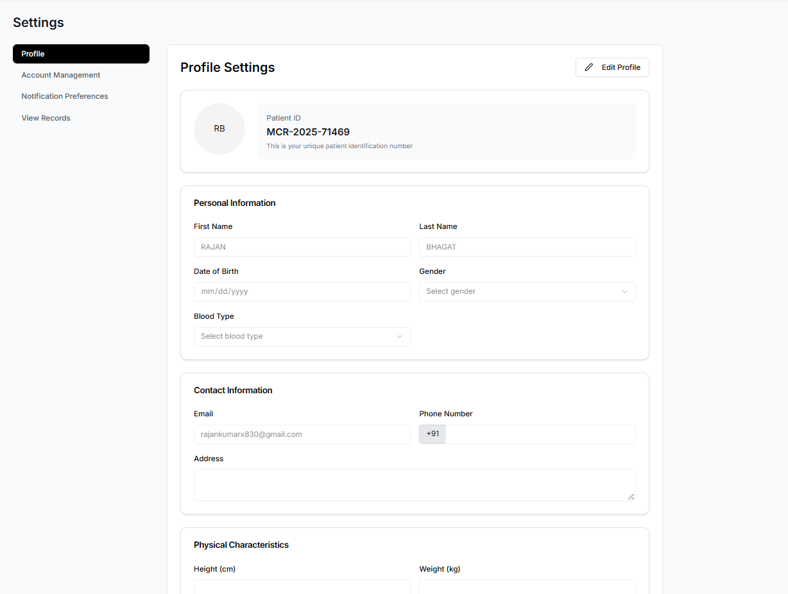

**Features:**
- Displays patient’s name, ID, email, and contact details.  
- Editable fields for personal data (DOB, gender, blood type, address, etc.).  
- Section for physical details such as height and weight.  
- Secure “Edit Profile” option allows users to update information anytime.  

This section ensures patient profiles are accurate and always up-to-date for doctors to access reliable health data.

---

#### 🔐 Account Management

The **Account Management** tab allows users to manage password, security, and authentication settings.

  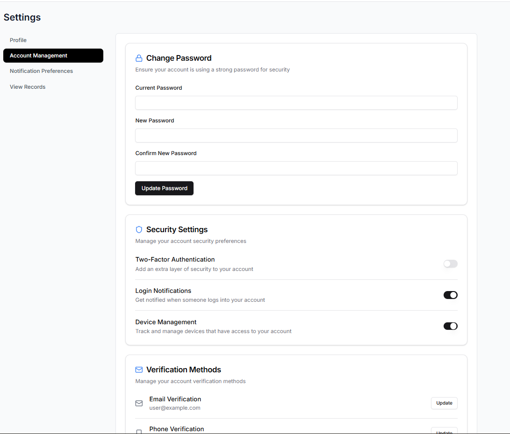

**Features:**
- **Change Password:** Patients can reset their password anytime for account safety.  
- **Security Settings:** Toggle options for:
  - Two-Factor Authentication (extra protection).  
  - Login Notifications (alerts when a new login occurs).  
  - Device Management (track logged-in devices).  
- **Verification Methods:** Manage email or phone verification for additional security.

This ensures data protection and gives patients confidence that their account and health data remain secure.

---

#### 🔔 Notification Preferences

Patients can customize which alerts they want to receive and how they are delivered.

  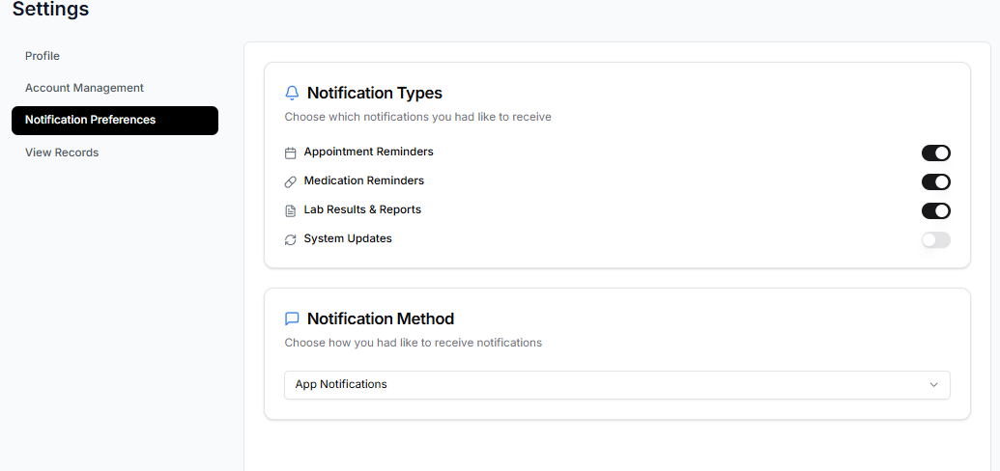

**Features:**
- Enable or disable notifications for:
  - Appointment Reminders  
  - Medication Reminders  
  - Lab Results & Reports  
  - System Updates  
- Choose preferred **Notification Method** (e.g., App Notifications, Email).  

This personalization helps patients stay informed about their health journey without unnecessary alerts.

---

#### 📁 View Records

Patients can securely upload and manage their medical history under the **View Records** section.

  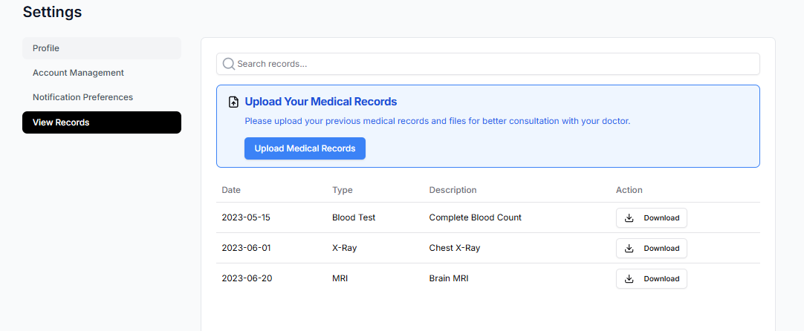

**Features:**
- Upload medical documents (X-rays, MRIs, lab results, etc.) for doctor consultation.  
- View all uploaded reports with details such as **Date**, **Type**, and **Description**.  
- Direct **Download** button for quick access to any medical file.  

This section ensures that patients’ health data is centralized, easily accessible, and ready for review during appointments.

---

#### 💡 Highlights of Settings Module
- Complete patient control over profile and security preferences.  
- Integration of personal, medical, and security data in a single dashboard.  
- Strong data protection with two-factor authentication and login tracking.  
- Easy medical record uploads for better doctor collaboration.  
- Clear, organized UI for effortless navigation between subsections.  

---

**In summary**, the **Patient Settings Module** in *mCare* ensures patients can manage their health profiles, security, and records independently — maintaining privacy, flexibility, and convenience while keeping healthcare data organized and accessible.

---
---
---

### 🩺 Doctor – Profile Completion & Verification

After registration, every doctor in *mCare* must complete their **Professional Profile** to ensure authenticity and maintain trust within the healthcare system.  
This step allows doctors to submit detailed credentials and qualifications for **admin verification** before being approved to provide consultations on the platform.

---

#### 🧾 Complete Your Profile

Once logged in, doctors are prompted to fill out their professional details such as **specializations**, **qualifications**, **experience**, and **medical license number**.  
This ensures that only certified professionals can practice through the platform.

  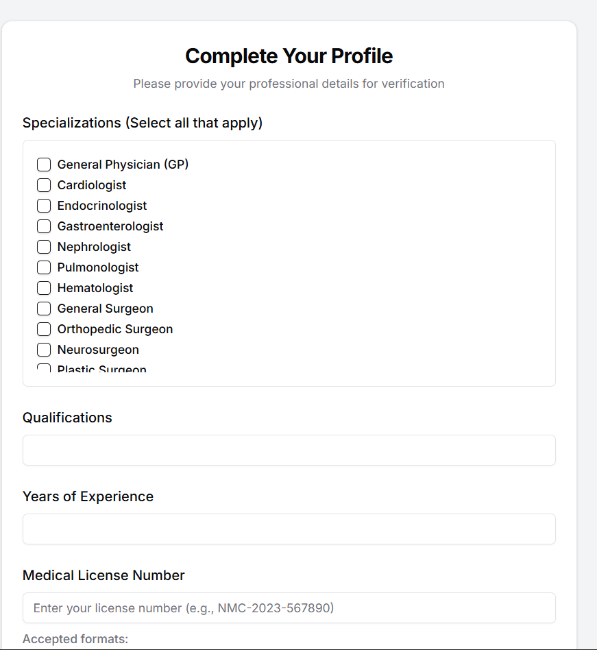

**Features:**
- Multiple **Specialization Selection** (e.g., Cardiologist, General Physician, Surgeon, etc.).  
- Input fields for **Qualifications**, **Years of Experience**, and **License Number**.  
- Standardized license format for verification (e.g., NMC-2023-567890).  
- Option to add short **About/Bio** describing professional background.  

---

#### 📄 Upload Required Documents

Doctors must upload their official credentials to verify their medical identity and registration.

  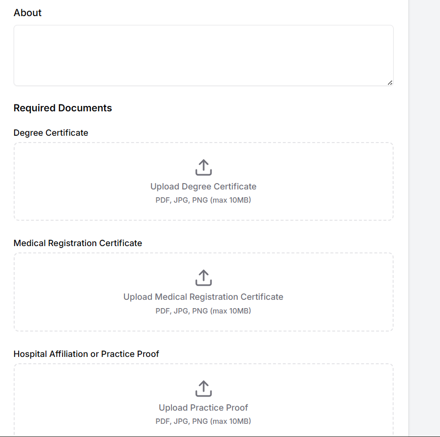

**Required Documents include:**
1. **Degree Certificate** (proof of education and qualification).  
2. **Medical Registration Certificate** (issued by Medical Council or equivalent authority).  
3. **Hospital Affiliation / Practice Proof** (to confirm active practice).  

Each upload supports PDF, JPG, or PNG format, with a maximum size of 10MB.  
This feature ensures all uploaded documents are safely stored and accessible only to system administrators for review.

---

#### 🏥 Clinic / Hospital Address

Doctors are required to provide their clinic or hospital details for accurate location-based services and patient communication.

  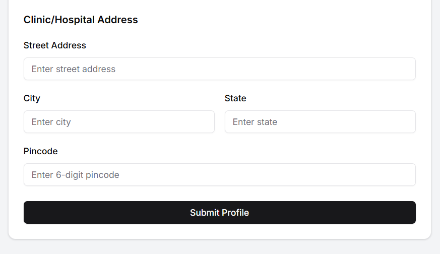

**Fields Include:**
- **Street Address**  
- **City, State, and Pincode**  

This ensures that patients can identify a doctor’s area of practice during appointment searches.

---

#### 🕵️ Admin Review & Verification

Once all profile details and documents are submitted, the doctor’s profile enters the **Admin Verification Stage**.  
The administrator reviews each submission and decides whether to **Accept** or **Reject** the application based on validity and authenticity of the credentials.

- ✅ **Accepted:** The doctor gains full access to the platform, including appointment management, prescription creation, and patient consultation features.  
- ❌ **Rejected:** The doctor is notified to re-upload or correct the submitted details.

This step upholds *mCare*’s commitment to providing verified, safe, and high-quality healthcare services.

---

#### 💡 Key Features of Doctor Verification Module
- Secure upload of degree, license, and affiliation documents.  
- Form-based professional data collection for standardized profiles.  
- Admin-controlled approval workflow for trust and transparency.  
- Automatic restriction on unverified accounts until admin approval.  
- Simple and responsive design for an efficient onboarding experience.

---

**In summary**, the **Doctor Profile Completion Module** ensures that only qualified and authenticated medical professionals are listed on *mCare*.  
This builds a secure and credible healthcare network — safeguarding both patient trust and platform integrity.

---
---

### 🩺 Doctor – Dashboard Overview

Once a doctor completes profile submission, the **Doctor Dashboard** serves as the central hub for all professional activities — from managing appointments to tracking patients and monitoring performance insights.  
It provides a quick, data-driven overview of the doctor’s practice and status within the *mCare* ecosystem.

---

#### ⏳ Profile Pending Verification

Before gaining full system access, newly registered doctors see a dashboard state that indicates **“Pending Verification.”**

  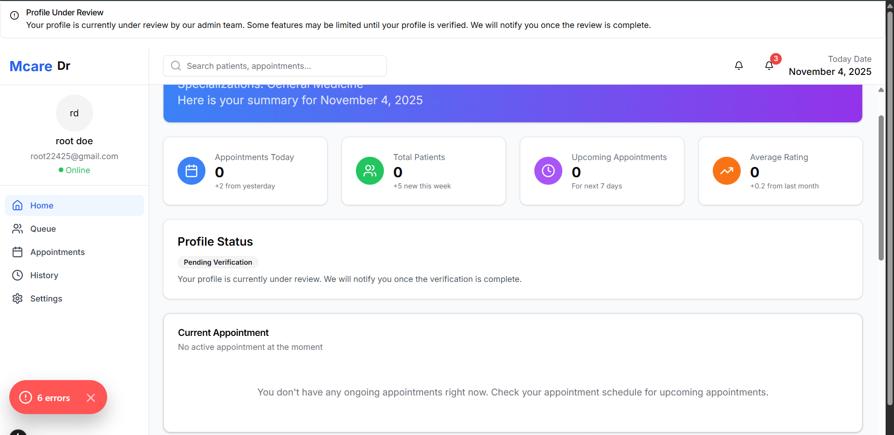

**Key Highlights:**
- A banner at the top notifies:  
  *“Your profile is currently under review by our admin team.”*  
- Some dashboard features (like appointment scheduling or prescription creation) remain temporarily restricted.  
- The **Profile Status** card displays:  
  🟡 *Pending Verification* – informing the doctor that admin approval is still awaited.  
- Basic metrics such as:
  - Appointments Today  
  - Total Patients  
  - Upcoming Appointments  
  - Average Rating  
  are displayed but inactive until verification completes.

This stage ensures quality control by allowing only verified and approved professionals to interact with patients on *mCare*.

---

#### ✅ Verified Profile – Active Dashboard

Once the admin verifies the credentials, the doctor gains full access to the system, and the dashboard updates automatically to reflect **Verified Status**.

  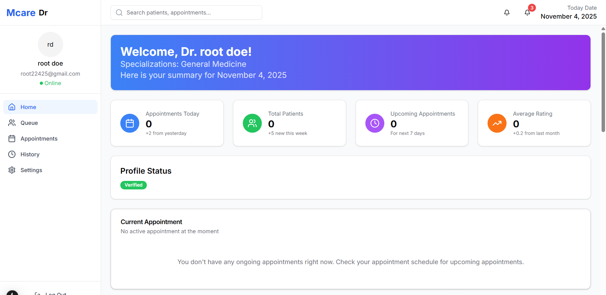

**Main Features:**
- A personalized greeting:  
  *“Welcome, Dr. [Name]! Specialization: [Field].”*  
  This creates a professional and engaging entry point.  
- Real-time analytics including:
  - **Appointments Today:** Tracks total consultations for the day.  
  - **Total Patients:** Displays cumulative and weekly patient stats.  
  - **Upcoming Appointments:** Shows upcoming scheduled visits within 7 days.  
  - **Average Rating:** Reflects patient feedback, updated monthly.  
- **Profile Status:** Marked as 🟢 *Verified*, confirming that the account is fully approved.  
- **Current Appointment:** Displays the active or next scheduled patient consultation.  

The design combines simplicity with analytics, giving doctors quick insights into their daily workflow and performance.

---

#### 🧭 Sidebar Navigation

The left sidebar allows seamless navigation between modules:
- **🏠 Home:** Dashboard overview with daily and weekly metrics.  
- **👥 Queue:** Displays waiting or ongoing patient sessions.  
- **📅 Appointments:** Manage upcoming, completed, or canceled consultations.  
- **📖 History:** Review past consultations and prescriptions.  
- **⚙️ Settings:** Update profile, change password, or manage security preferences.  

This structure keeps navigation intuitive and efficient for busy medical professionals.

---

#### 💡 Dashboard Highlights
- Role-based access control ensures unverified doctors cannot access patient data.  
- Clear, color-coded verification status indicators.  
- Dynamic statistics for better decision-making and practice management.  
- Simplified layout for both desktop and tablet use.  
- Integration with reminders and patient history modules.  

---

**In summary**, the **Doctor Dashboard Module** in *mCare* provides an all-in-one workspace for verified healthcare professionals — enabling them to manage patients, monitor appointments, and stay informed about their practice performance, all while maintaining a secure and trusted system.
---
---

### 🕒 Doctor – Availability & Schedule Management

The **Manage Appointments** section empowers doctors to take full control of their consultation timings and daily workflow.  
This module allows doctors to configure their **working hours, manage breaks, mark leave days, and generate automatic appointment slots**, ensuring an organized and flexible schedule.

---

#### ⚙️ Manage Availability Interface

  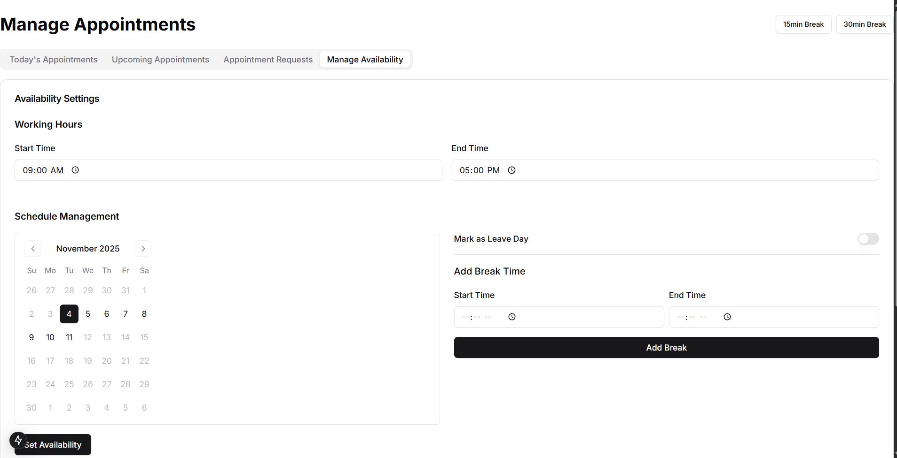

The **Manage Availability** tab is located under the “Appointments” section.  
Here, doctors can:

- **Set Working Hours:** Define daily start and end times for consultations.  
- **Mark Leave Days:** Easily disable availability on selected calendar dates.  
- **Add Break Time:** Specify custom breaks (e.g., lunch or rest periods).  
- **Quick Buttons:** Instantly add 15 or 30-minute breaks using shortcut buttons.  

The built-in calendar allows doctors to navigate through months and configure their schedules in advance, ensuring smooth time management and preventing appointment conflicts.

---

#### 📅 Saved Availability & Time Slots

  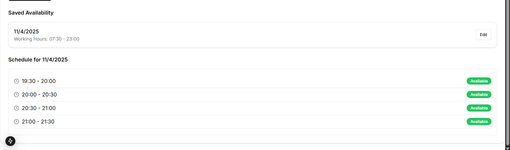

Once working hours are set, *mCare* automatically divides the time into available appointment slots (e.g., 30-minute intervals).  
Doctors can view, edit, or update their availability at any time.

**Key Features:**
- **Saved Availability Section:** Displays configured date and active working hours.  
- **Slot Generation:** The system auto-generates slots within defined working hours.  
- **Status Labels:** Each slot shows real-time availability status (`Available`, `Booked`, or `Closed`).  
- **Edit Option:** Doctors can update or adjust availability as needed.  

This smart scheduling system ensures that patients can only book within available time frames — reducing scheduling conflicts and optimizing doctor workload.

---

#### 💡 Highlights of Availability Module
- Dynamic calendar-based scheduling for flexible planning.  
- Real-time synchronization with patient booking system.  
- Leave and break management for better time balance.  
- Editable slots and status tracking for transparency.  
- Designed with simplicity and speed for daily usability.  

---

**In summary**, the **Doctor Availability & Schedule Management** module provides healthcare professionals with full autonomy over their consultation timings, ensuring efficiency, reduced scheduling errors, and a balanced professional routine within the *mCare* ecosystem.

